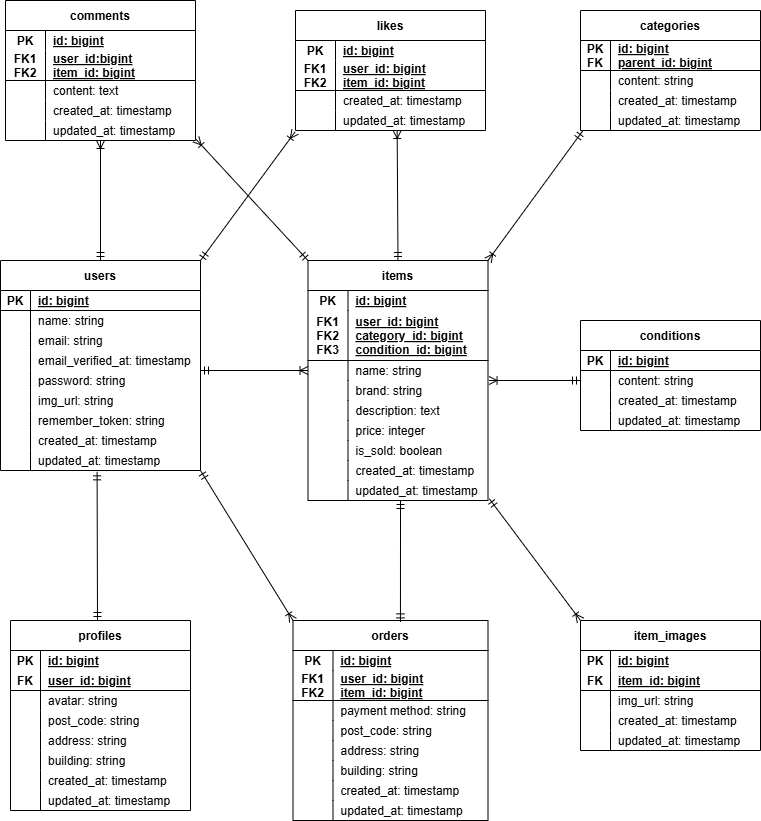
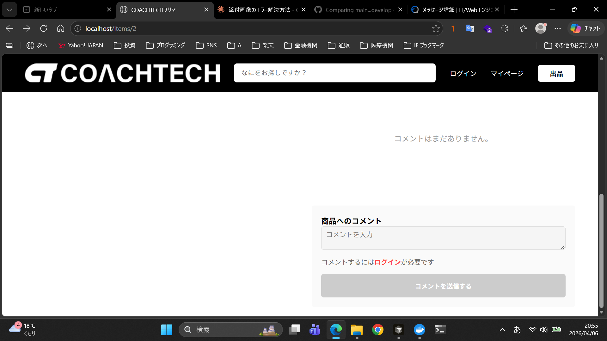
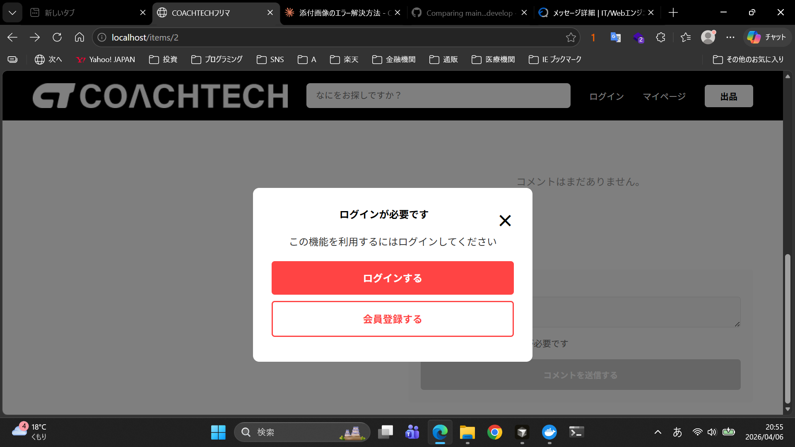
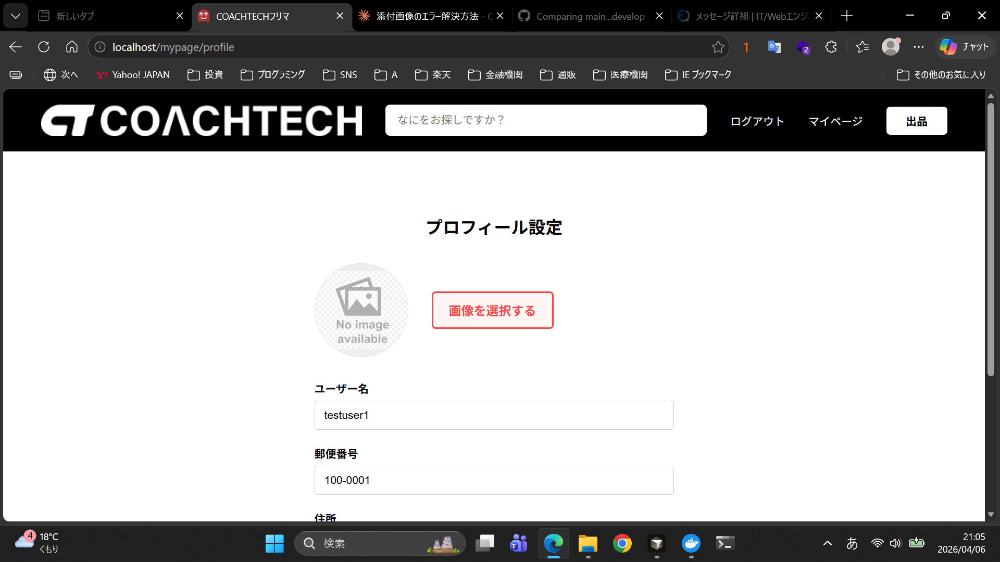
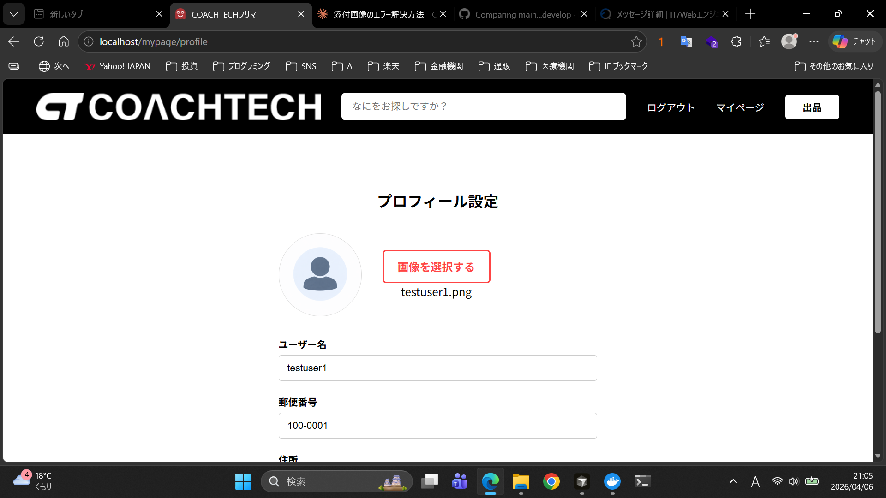

# COACHTECHフリマ

## アプリケーション概要
フリマアプリのポートフォリオです。
商品の出品・購入・いいね・コメント・プロフィール編集・メール認証・Stripe決済などの機能を実装しています。


## 環境構築
### Dockerビルド
```bash
git clone
cd flea-market
docker-compose up -d --build
```

### Laravel環境構築
```bash
docker exec -it flea-market-php-1 bash
composer install
cp .env.example .env
php artisan key:generate
php artisan migrate
php artisan db:seed
php artisan storage:link
npm install
npm run build
exit
```

> **補足**: `docker-compose.yml` に queue-worker コンテナが含まれており、起動時に自動でキュー処理が開始されます。購入完了メールはキュー経由で送信されるため、queue-worker が起動していることを確認してください。

### .env 設定について
.env.example をコピーした時点でメール・DB設定の初期値が入っています。
Stripe のキーのみ、各自のテストキーを設定してください。

```
# Stripe（各自のテストキーを設定）
STRIPE_KEY=pk_test_xxxxx
STRIPE_SECRET=sk_test_xxxxx
```

### 開発環境URL
| 用途 | URL |
| --- | --- |
| アプリ | http://localhost/ |
| MailHog（メール確認） | http://localhost:8025 |
| phpMyAdmin           | http://localhost:8080 |


## 使用技術（実行環境）
| 技術 | バージョン |
| --- | --- |
| PHP | 8.4 |
| Laravel | 12 |
| MySQL | 8.0 |
| nginx | latest |
| Laravel Fortify | ^1.34 |
| Stripe PHP | ^19.4 |


## ER図



## 動作確認用アカウント
| アカウント | パスワード | 用途 |
| --- | --- | --- |
| test1@example.com | password | 認証済み・全機能確認用 |
| test2@example.com | password | 未認証・メール認証誘導機能の確認用 |
| test3@example.com | password | 認証済み・全機能確認用 |


## メール確認環境（MailHog）
開発環境では MailHog を使用しています。
- **確認方法**: http://localhost:8025 にアクセスして受信メールを確認してください。
- **補足**: シーダー作成ユーザー（test2@example.com）でテストする場合は、画面内の「認証メールを再送する」をクリックすると MailHog にメールが届きます。
- **注意**: メール本文内のリンクのホスト部分が正しく解決されない場合は、アドレスバーにて `localhost` に読み替えてアクセスしてください。


## コンビニ決済に関する補足（FN023応用）
Stripe のコンビニ決済画面への接続を実装しています。

**制限事項**: ローカル開発環境の Webhook 受信設定の兼ね合いにより、コンビニ決済完了後の自動ステータス更新（Ordersテーブルへの保存・自動リダイレクト）は動作しません。

**動作確認手順**:
1. 「支払い番号発行画面（Stripe決済案内画面）」が表示されることを確認。
2. クレジットカード決済では「Ordersテーブルへの保存」「MailHogへのメール送信」「商品一覧への自動リダイレクト」の全工程が正常動作することを確認済みです。


### UX向上のためのJavaScript実装（独自追加）
要件には記載がなかったが、ユーザー体験向上を目的としてJavaScriptを独自に実装した。

① 未認証ユーザーへのログイン誘導モーダル
未認証状態でいいね・コメント送信などのログインが必要な操作を行った際に、ログイン画面・会員登録画面へのリンクを含むモーダルを表示し、離脱を防ぐ導線を設けた。

| 操作前（ログイン促しメッセージ表示）  | モーダル表示 |
| --- | --- |
|  |   |

② プロフィール画像選択時のファイル名即時表示
プロフィール設定画面で画像を選択した際、保存完了前でも選択したファイル名をその場で表示することで、意図したファイルが選択できているかを確認しやすくした。

| 画像未選択時 | 画像選択後（ファイル名表示） |
| --- | --- |
|  |  |


## PHPUnitテスト

### テスト環境セットアップ
```bash
# テスト用DBを作成
docker exec -it flea-market-mysql-1 bash
mysql -u root -p
# パスワード: root
create database test_database;
exit
exit

# テスト用マイグレーション実行
docker exec -it flea-market-php-1 bash
php artisan migrate:fresh --env=testing
exit
```

> **注意**: `.env.testing` は `.gitignore` により管理対象外です。`.env` をコピーして作成し、`DB_DATABASE=test_database` に変更してください。Stripe のキーも設定してください。

### テスト実行
```bash
docker exec -it flea-market-php-1 bash
./vendor/bin/phpunit
exit
```
### テスト結果
Tests: 42, Assertions: 102, OK


## テーブル設計のポイント
| テーブル | キーワード | 設計意図 |
| --- | --- | --- |
| conditions | データの整合性 | 「良好」「目立った傷なし」などの選択肢を固定し、表記ゆれを防ぐ |
| item_images | 1対多の対応 | 1商品に複数画像を登録できる拡張性を持たせる |
| profiles | 責務の分離 | ログイン情報（users）と住所等の個人情報（profiles）を分けて管理 |

### カテゴリの複数選択について
要件ではカテゴリの複数選択が求められていましたが、テーブル数9個以内という制約により中間テーブル（item_categories）を作成できませんでした。
そのため、items テーブルに category_id を持つ単一選択（プルダウン形式）で実装しています。


## 本番環境（Render）

### URL
https://flea-market-v11e.onrender.com

### 注意事項
- シーダーは本番環境では自動実行されません。テストは手動でアカウント登録して行ってください。
- MailHogは本番環境では使用できません。メール認証機能の確認はローカル環境で行ってください。
- 無料プランのため、一定時間アクセスがないとスリープします。初回アクセス時に50秒程度かかる場合があります。